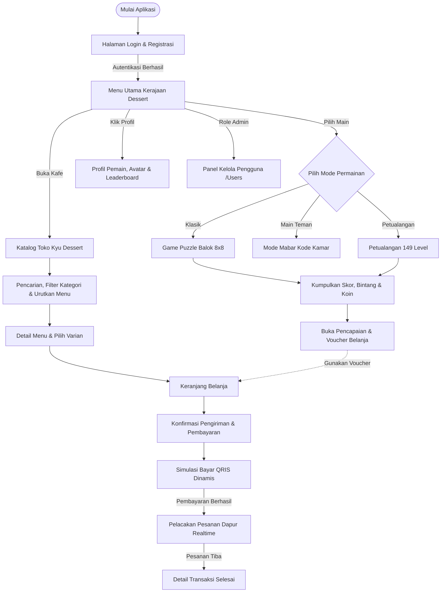

# 🧁 Kyu's Dessert World & Boutique Cafe

Aplikasi web fullstack monorepo yang memadukan permainan teka-teki kasual bertema dessert dengan platform belanja *e-commerce* toko kue artisanal (*Kyu Dessert & Cafe*). 

Proyek ini dibangun menggunakan arsitektur **ASP.NET MVC 5** dan **Web API 2 (.NET Framework 4.8)** dengan **Entity Framework 6** dan basis data relasional **Microsoft SQL Server**. Dirancang dengan tampilan antarmuka ramah pengguna bernuansa *warm dessert aesthetic*, tata letak responsif untuk perangkat mobile maupun desktop, efek suara interaktif, serta alur transaksi nyata dari keranjang hingga pelacakan pesanan.

---

## 🌟 Fitur Utama Aplikasi

### 1. 🎮 Game Puzzle & Petualangan Dapur
* **Mode Klasik (8x8)**: Permainan susun balok tanpa batas waktu untuk mencetak skor tertinggi, dilengkapi efek visual combo dan sound effect dinamis.
* **Mode Petualangan (149 Level)**: Penjelajahan level dengan target misi spesifik (mengumpulkan kue stroberi, donut, dan es krim) untuk mendapatkan bintang dan koin toko.
* **Mode Main Bersama (Mabar)**: Fitur bermain teka-teki santai bersama teman secara realtime menggunakan kode kamar unik.
* **Koleksi Resep & Dapur Memasak**: Pemain dapat menukarkan koin hasil bermain untuk membuka resep dessert baru dan memasaknya di dapur interaktif.

### 2. 🍰 E-Commerce Kyu Dessert & Cafe
* **Katalog Menu Lengkap**: Menampilkan puluhan pilihan kue dan minuman artisanal dengan paginasi dinamis serta pengurutan fleksibel (A-Z, Z-A, harga terendah/tertinggi, menu terbaru).
* **Pencarian & Penyaringan**: Cari menu berdasarkan kata kunci pencarian serta filter instan berdasarkan kategori menu.
* **Detail Menu & Varian**: Informasi bahan kue, pilihan varian porsi/rasa, catatan khusus pembeli, serta ulasan pelanggan.
* **Keranjang Belanja Interaktif**: Perhitungan harga otomatis dan integrasi voucher diskon yang didapatkan dari pencapaian dalam game.
* **Simulasi Pembayaran & Pelacakan**: Alur pembayaran instan dengan simulasi QRIS dinamis, batas waktu pembayaran, serta pelacakan status pesanan dapur secara berkala (Dikonfirmasi -> Diproses Chef -> Diantar -> Selesai).

### 3. 🔐 Autentikasi & Keamanan Akun
* **Autentikasi Pengguna**: Mendukung pendaftaran akun baru, login sesi, dan penyimpanan token aman.
* **Role-Based Access Control (RBAC)**: Pembagian hak akses antara akun biasa (*User*) dan administrator (*Admin*). Akun Admin memiliki fitur tambahan untuk melihat seluruh daftar pengguna dan menonaktifkan akun (*soft delete*) melalui panel `/Users`.
* **Pemulihan Akun via OTP**: Fitur lupa password dengan pengiriman kode verifikasi OTP 6-digit otomatis ke alamat email pengguna (kedaluwarsa 2 menit).
* **Keamanan Data**: Enkripsi password menggunakan algoritma *hashing* SHA-256 dan salt, proteksi anti-SQL Injection melalui parameterized query Entity Framework, serta Anti-Forgery Token.

---

## 💻 Teknologi yang Digunakan

* **Backend**: ASP.NET MVC 5, ASP.NET Web API 2, C# (.NET Framework 4.8)
* **Database & ORM**: Microsoft SQL Server, Entity Framework 6 (Code First & Database First)
* **Frontend**: HTML5, Vanilla CSS3 (Custom Responsive Layout), JavaScript (ES6+), jQuery
* **Komponen & Library**:
  * Bootstrap 5 (Grid System & Modals)
  * SweetAlert2 (Toast & Dialog Notifikasi)
  * Web Audio API & HTML5 Audio (BGM & Sound Effects)
  * System.Net.Mail SMTP (Email Layanan OTP)

---

## 📁 Struktur Folder Proyek

```
UAS_C#_Lanjutan/
│
├── UAS_C#_Lanjutan.sln                 # Berkas Solusi Visual Studio
├── Kyu_Dessert_World_API.postman_collection.json  # Dokumentasi pengujian API Postman
├── README.md                           # Berkas panduan & dokumentasi proyek
├── .gitignore                          # Konfigurasi pengabaian berkas sementara Git
├── *.sql                               # Skrip inisialisasi dan data awal basis data
│
└── UAS_C#_Lanjutan/                    # Direktori Utama Aplikasi Monorepo
    ├── App_Start/                      # Konfigurasi RouteConfig, WebApiConfig, BundleConfig
    ├── Controllers/
    │   ├── AuthController.cs           # Web API Autentikasi, Token, & OTP Email
    │   ├── ProductsApiController.cs    # RESTful API Produk (GET, POST, PUT, PATCH, DELETE)
    │   ├── UserApiController.cs        # Web API Gameplay, Profil, & Level Puzzle
    │   └── MVC/
    │       ├── AccountController.cs    # Halaman Login, Register, & Sesi Pengguna
    │       ├── ErrorController.cs      # Penanganan Halaman Error Kustom (401, 403, 404, 500)
    │       ├── MainMenuController.cs   # Menu Utama, Profil, Upload Avatar, Resep & Dapur
    │       ├── PuzzleController.cs     # Tampilan Game Mode Klasik, Petualangan, & Mabar
    │       ├── ShopController.cs       # Katalog Toko, Keranjang, Checkout, & Tracking
    │       └── UsersController.cs      # Panel Kelola Akun Pengguna (Khusus Role Admin)
    ├── Models/
    │   ├── Entity/                     # Entitas Model Database (User, ShopProduct, Order, dll.)
    │   └── Viewmodel/                  # Data Transfer Objects & ViewModel
    ├── Services/
    │   └── Context/
    │       └── GameDbContext.cs        # Entity Framework DbContext
    ├── Views/                          # Halaman Tampilan Razor MVC (.cshtml)
    │   ├── Account/                    # Antarmuka Login & Autentikasi
    │   ├── Error/                      # Antarmuka Error Kustom (Unauthorized, Forbidden, dll.)
    │   ├── MainMenu/                   # Beranda Game, Buku Resep, dan Dapur Memasak
    │   ├── Puzzle/                     # Arena Bermain Balok Teka-Teki
    │   ├── Shop/                       # Halaman Katalog, Keranjang, Checkout, & Tracking
    │   └── Users/                      # Panel Manajemen Pengguna (Admin)
    ├── Scripts/                        # Logika JavaScript Interaktif
    │   ├── client-router.js            # Pelindung Rute & Pengarah Akses Client-Side
    │   ├── dessert-auth.js             # Penanganan Form Autentikasi & OTP
    │   ├── main-menu.js                # Interaksi Menu Utama & Toko Resep
    │   ├── puzzle-classic.js           # Mesin Game Balok Klasik
    │   └── puzzle-adventure.js         # Mesin Game Mode Petualangan Level
    ├── Content/                        # Aset Statis (Tema CSS, Efek Suara, Gambar Menu)
    └── Web.config                      # Konfigurasi Aplikasi, Database, & Batas Upload
```

---

## ⚙️ Panduan Instalasi & Menjalankan Aplikasi

### 1. Prasyarat Sistem
* **Visual Studio 2022** (dengan beban kerja *ASP.NET and web development*).
* **Microsoft .NET Framework 4.8**.
* **Microsoft SQL Server** (Express / Developer / LocalDB) & **SQL Server Management Studio (SSMS)**.
* **Postman** *(opsional, untuk pengujian endpoint API)*.

### 2. Pengaturan Basis Data
1. Buka SSMS dan buat database baru dengan nama:
   ```sql
   CREATE DATABASE [UAS];
   ```
2. Jalankan skrip database yang tersedia pada repositori:
   - Jalankan `Tabel Create_utf8.sql` (untuk membuat tabel-tabel utama).
   - Jalankan `Insert Query.sql` (untuk mengisi data resep, level game, dan menu toko).
   - Jalankan `add_soft_delete_columns.sql` (untuk memastikan kolom penonaktifan data/soft delete siap digunakan).
   - (Agar semua clean, disarankan run saja semua sql yang tersedia)

### 3. Konfigurasi Koneksi Database
Buka berkas `Web.config` pada baris `<connectionStrings>` dan pastikan nama server SQL Server sesuai dengan konfigurasi komputer Anda:
```xml
<connectionStrings>
  <add name="GameDbContext" 
       connectionString="Data Source=.\SQLEXPRESS;Initial Catalog=UAS;Integrated Security=True;MultipleActiveResultSets=True" 
       providerName="System.Data.SqlClient" />
</connectionStrings>
```

### 4. Menjalankan Aplikasi
1. Buka berkas `UAS_C#_Lanjutan.sln` di Visual Studio.
2. Klik kanan pada baris paling atas: Solution 'UAS_C#_Lanjutan'
3. Pilih Restore NuGet Packages
4. Lakukan restorasi paket dependensi: menu **Build -> Rebuild Solution**.
5. Jalankan aplikasi dengan menekan tombol **IIS Express (Google Chrome / Edge)** atau tombol pintas **F5**.
6. Browser akan otomatis membuka halaman utama game dan toko.

---

## 🔑 Akun Demo Pengujian

Tersedia akun siap pakai untuk menguji seluruh fungsionalitas aplikasi:

| Role / Hak Akses | Username | Password | Keterangan Pengujian |
|---|---|---|---|
| **Administrator (Admin)** | `zakysetiawan` | `zakyAdmin` | Memiliki akses ke tombol **🛡️ Kelola User** (`/Users`) untuk melihat semua data pemain dan melakukan penonaktifan akun (*soft delete*), serta memiliki saldo 10.000.000 koin untuk mencoba game & belanja. |
| **Pemain Biasa (User)** | `player1` | `player123` | Akun standar pemain untuk menguji alur pengguna umum tanpa akses admin. *(Pengguna juga dapat mendaftarkan akun baru melalui form Register).* |

---

## 📬 Pengujian API Menggunakan Postman

Untuk mempermudah pengujian endpoint backend secara mandiri:
1. Buka aplikasi **Postman**.
2. Klik tombol **Import** di sudut kiri atas, lalu pilih berkas:
   ```
   Kyu_Dessert_World_API.postman_collection.json
   ```
3. Seluruh endpoint telah dikelompokkan secara terstruktur (Autentikasi, Gameplay, Toko E-Commerce, dan RESTful Products).
4. Pastikan aplikasi sedang berjalan di IIS Express (`https://localhost:44350`), lalu klik tombol **Send** untuk menguji respons data.

---

## 🔄 Alur Sistem & Interaksi Pengguna (Flowchart)



---
*Kyu's Dessert World & Cafe — Proyek Pengembangan Aplikasi Pemrograman C# Lanjutan.*
